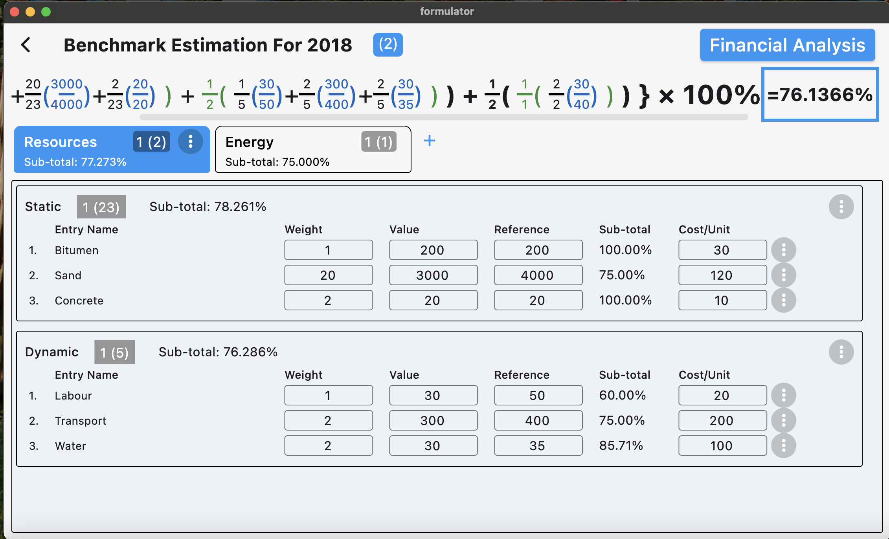
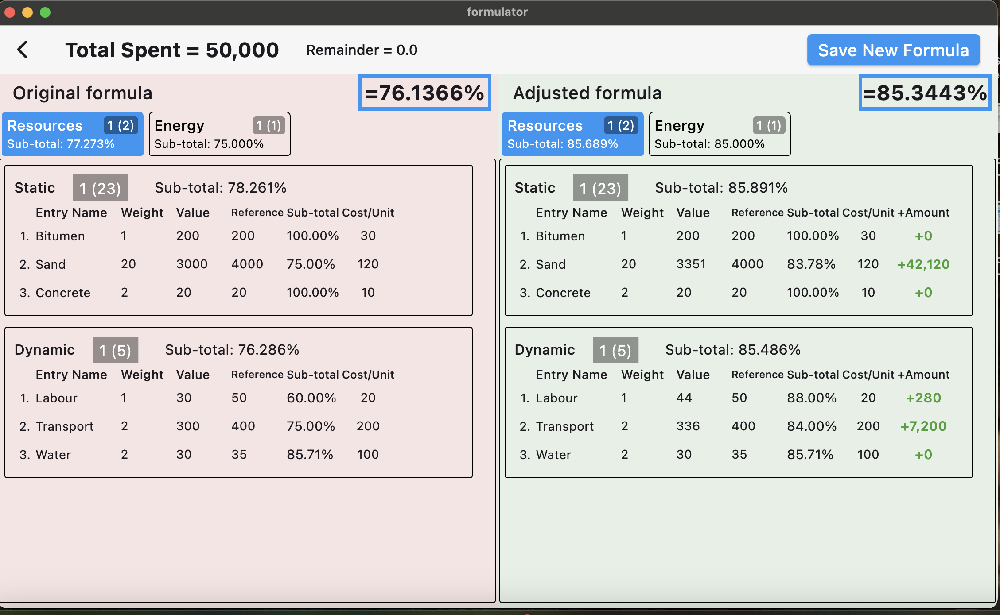

# formulator

A Flutter-based development analyzer and cost estimator for organizational benchmarking.

## Description
Formulator is a development and cost estimation application developed as a Mechanical Engineering Master's project developed for a student of Prof. P. K. Oke, the Dean of the School of Metallurgical and Manufacturing Engineering (SIMME) in the Federal University of Technology, Akure.

## Purpose

The main purpose of the application is:
1. To analyse the estimated level of development of an organisation as compared to a benchmark and express this in numerical values.
2. To analyse the cost required to bring the level of development to a particular level.
3. To properly distribute the cost in such a manner as to maximize impact of the resources on the level of development.

To achieve this purposes, advanced academic algorithms are implemented and the results are displayed in a perfectly reactive and sleek modern User interface.

## Screenshots

| Analysis Screen | Results Screen |  
|-----------------|----------------|  
|  |  |  
*Left: Input parameters for analysis. Right: Generated cost/distribution results.*  

## Contributing
We welcome contributions from anyone. To contribute to the project, please follow these steps:
- Fork the repository.
- Create a new branch for your feature or bugfix.
- Make your changes and commit them.
- Push your changes to your forked repository.
- Open a pull request against the main branch of this repository.

